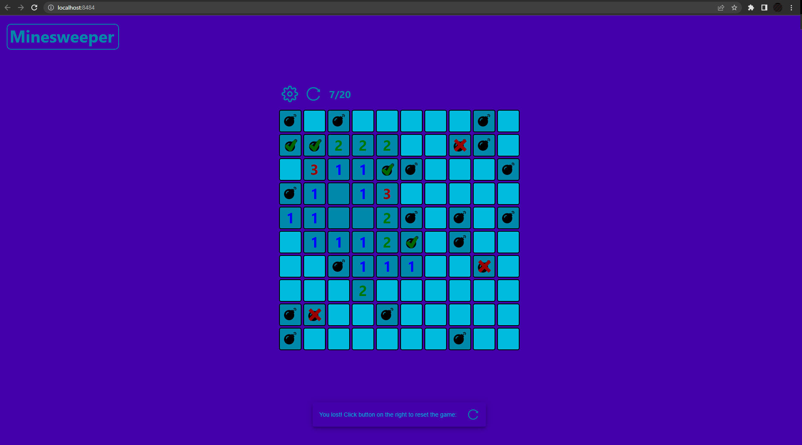

# React Minesweeper Game
This project is for me to better understand all stages of React apps development.

This is just a regular Minesweeper - reveal tiles and find all mines!

## Overview

## Installation
1. `git clone https://github.com/DawidekZagajnik/react-minesweeper-game.git`
2. `docker build -t react-minesweeper .`
3. `docker run -p 8484:80 react-minesweeper`